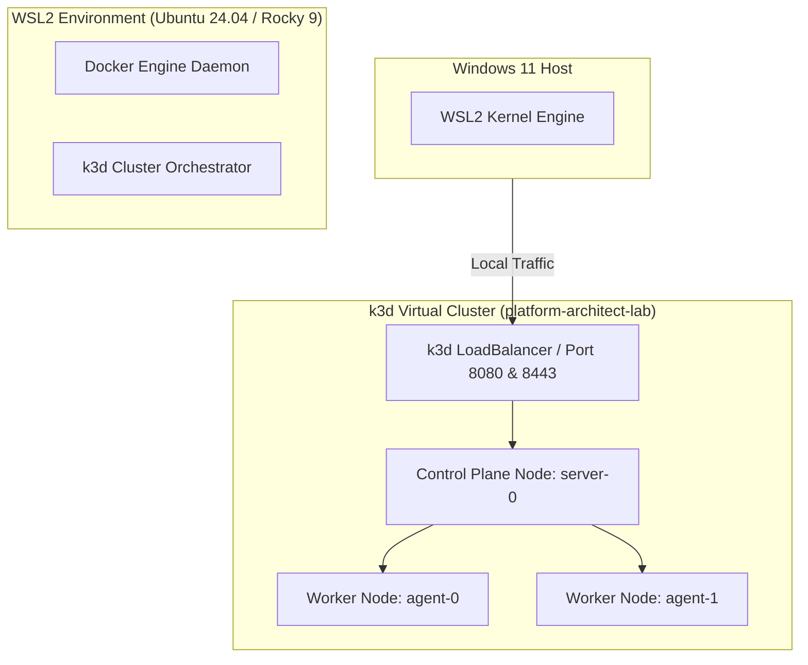
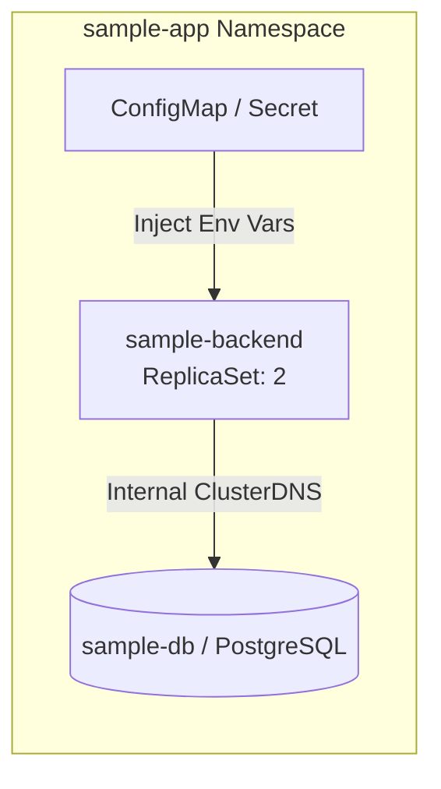

# Kubernetes Local Laboratory (k3d + WSL2)

[](https://github.com/elserhumano/k8s-local-lab/actions/workflows/ci.yaml)


This repository contains the blueprints and automation scripts to bootstrap a production-like, multi-node **Kubernetes Local Laboratory** running on **Windows 11 (via WSL2)** using **k3d**. It is designed to serve as a high-performance sandbox for CNCF ecosystem tools, GitOps workflows, and Platform Engineering architecture experiments.

## 📐 Architecture Overview




## 🛠️ Repository Structure

```text
k8s-local-lab/
├── cluster/
│   └── config.yaml         # Declarative k3d multi-node topology configuration
├── scripts/
│   ├── install-deps.sh     # OS-agnostic dependency installation script (Ubuntu/RHEL)
│   └── create-cluster.sh   # Cluster provisioning and kubeconfig context merging script
└── apps/
    └── sample-app/         # Native multi-tier architectural mockup deployed via Kustomize
```

## 🚀 Getting Started

### 1. Prerequisites
Ensure you have **WSL2** enabled on your Windows 11 machine and a Linux distribution installed (e.g., Ubuntu 24.04 LTS or Rocky Linux 9).

### 2. Install Dependencies
Run the idempotent setup script inside your WSL2 terminal to install Docker Engine, `k3d`, and `kubectl`:

```bash
chmod +x scripts/install-deps.sh
./scripts/install-deps.sh
```
*Note: If Docker was freshly installed by the script, restart your WSL2 session (`wsl --shutdown` from Windows PowerShell) to apply user group privileges.*

### 3. Bootstrap the Cluster
Provision the multi-node cluster topology using the declarative configuration file:

```bash
chmod +x scripts/create-cluster.sh
./scripts/create-cluster.sh
```

### 4. Deploy the Sample Application
Verify cluster readiness and networking by deploying the declarative multi-tier configuration utilizing **Kustomize**:

```bash
kubectl apply -k apps/sample-app/
```

Verify that the microservices, configuration layers, and workload replicas are rolling out seamlessly:

```bash
kubectl get all -n sample-app
```

## 💎 Platform Architecture Highlights

- **Multi-Node Topology:** Simulates real-world production constraints with 1 Control Plane and 2 Worker nodes instead of a standard single-node setup.
- **Port Mapping Decoupling:** Bypasses default Traefik integration on setup to allow custom implementations of enterprise ingress controllers (e.g., NGINX Ingress, Istio Service Mesh).
- **Environment Agnosticism:** Scripts adapt organically between Debian/Ubuntu (`apt`) and RHEL/Rocky (`dnf`) distribution package managers.
- **GitOps Readiness:** Configurations are written explicitly to accommodate seamless future migrations toward GitOps reconciliation loops via ArgoCD or FluxCD.

---

## 📦 Sample Application Architecture

The repository includes a decoupled, multi-tier **Todo Application** mockup to validate cluster networking, horizontal scaling, and secure configuration injection. It avoids monolithic "Hello World" anti-patterns by introducing cloud-native production standards:



### Architectural Capabilities Demonstrated:
* **Separation of Concerns:** Configurations (`ConfigMap`) and sensitive data (`Secret`) are fully decoupled from the application lifecycle templates.
- **High Availability (HA):** The backend tier scales across **2 active replicas**, demonstrating real-world pod distribution and internal service load balancing.
- **Declarative Composition:** Managed exclusively via **Kustomize**, enabling seamless overlay generation without resorting to heavy packaging overhead for simple local configurations.

### Verification Matrix
Once deployed, validate the decoupling and state of the application components by running:

```bash
# Check all deployed resources within the dedicated namespace
kubectl get all -n sample-app

# Inspect secure environment injection from Secrets
kubectl describe deployment sample-backend -n sample-app | grep -A 5 Environment
```

---

## 🧪 Continuous Integration & Quality Gates

To enforce Enterprise GitOps standards, this repository integrates an automated **CI Pipeline via GitHub Actions** (`.github/workflows/ci.yaml`). Every push or pull request triggers static analysis checks to guarantee code quality before any infrastructure component hits the environment:

- **YAML Validation (`yamllint`):** Scans all Kustomize configurations and Kubernetes manifests to prevent indentation failures or structural syntax errors.
- **Shell Script Auditing (`shellcheck`):** Executes rigorous static testing on the provisioning scripts (`scripts/`) to intercept potential execution bugs, security vulnerabilities, or POSIX compliance drift.

